# Histogram equalization 

> is the way we choose to equalize the intensity of the images, [OpenCV](https://docs.opencv.org/3.4/d4/d1b/tutorial_histogram_equalization.html) has Implementation of it which handles gray images, so according to this  [StackoverFlow post](https://stackoverflow.com/questions/31998428/opencv-python-equalizehist-colored-image#38312281) in RGB images each Chanel represents the **intensity of the related color,** so we saturated the **Brightness** of the image, By using **standardized** colors paces that encode brightness and color **separately** like (YCbCr, HSV, ect ). 

and then **Apply simple Histogram**, because Histogram lacking results, due to its lack of rag rad to outliers and the location of the pixel, we chose to implement Contrast Limited Adaptive HE witch have better slightly better RESTPlus.

## results 

>

>

>

>

--- 

## techniques used in each task

--- 

> task 1 --> Contrast Limited Adaptive HE
> 
> task 2 --> (resnet50 - imageNet)
> 
> task 3 --> yolov5 
> 
> task 4 --> k-mean, mean shift 

### Training and Testing times. 

---

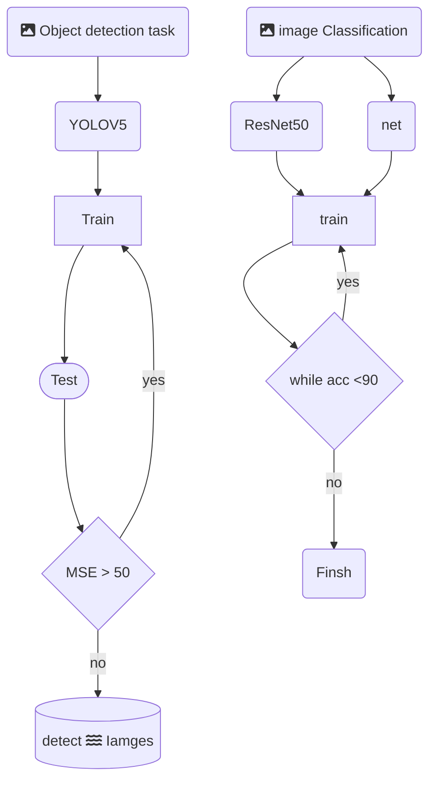
 > **YOLOV5** --> 18
> 
> **ImageNEt** 5
> 
> **ResNet50** 4
> 
 > k-means and mean shift --> 5
 > 

---

## Accuracy 

---
- Image Net --> 91 acc
- YOLO5
>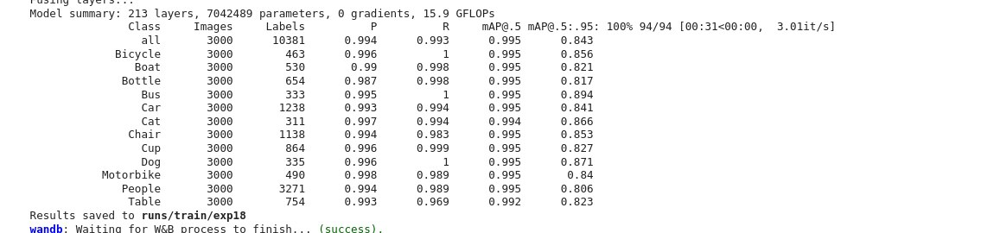
> 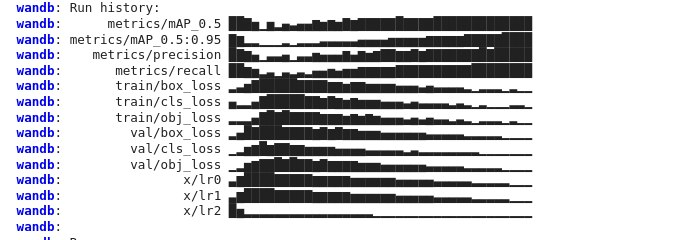
> 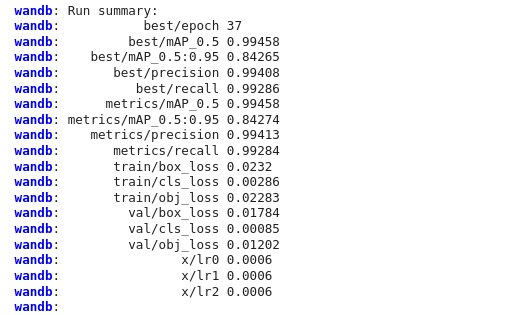
> 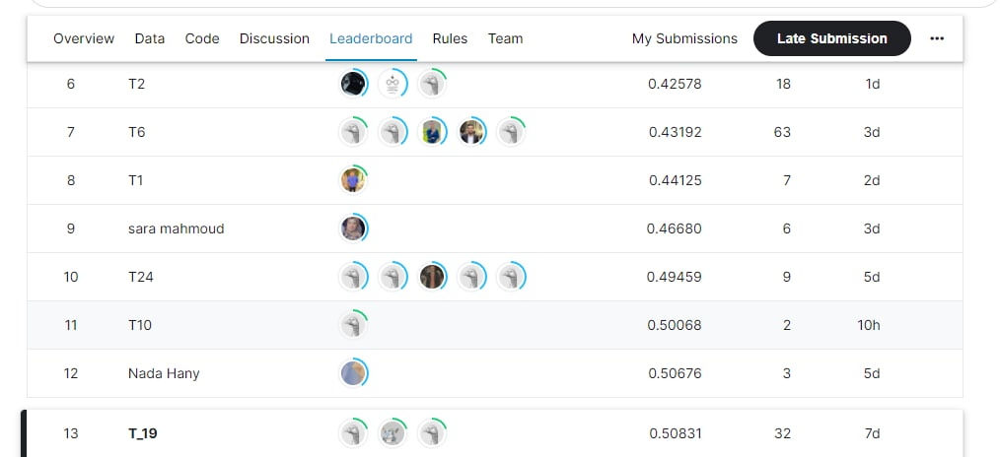
>
- segmentation 
> Results
> 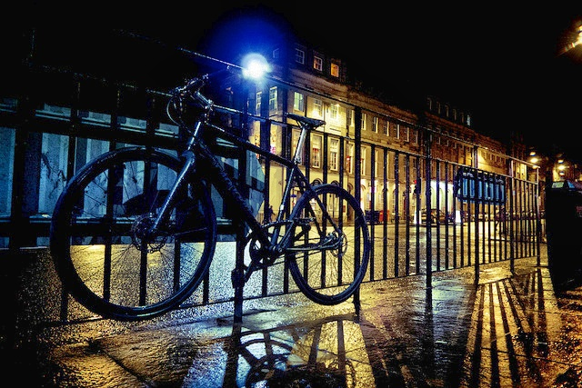
> 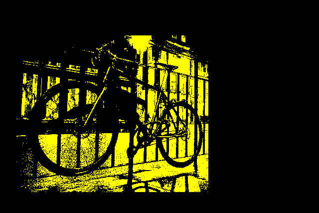
> 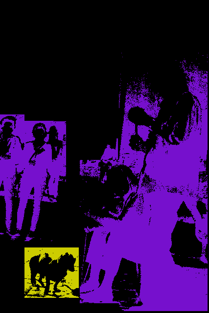
> 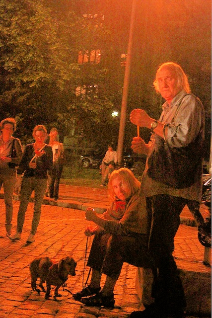
> 
- Object detection 
>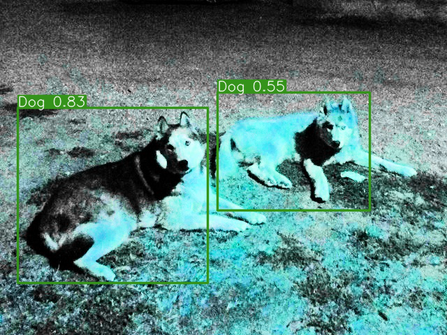
> 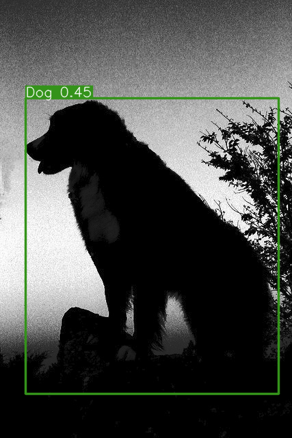
> 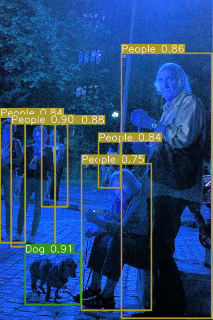
> 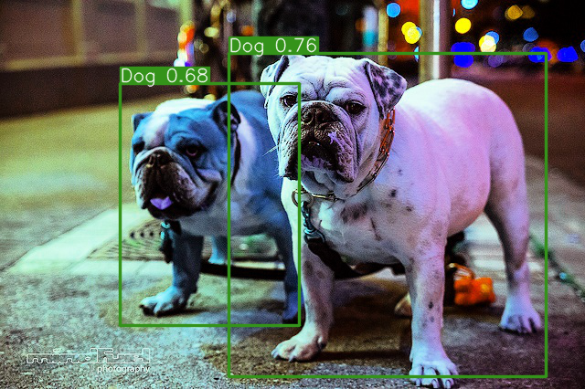
> 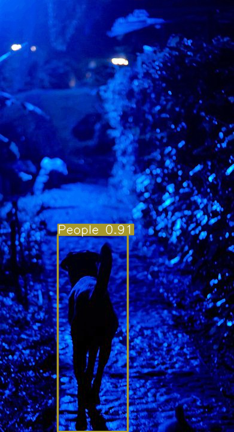